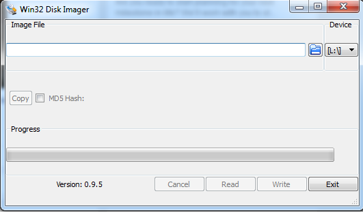
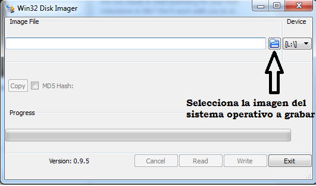
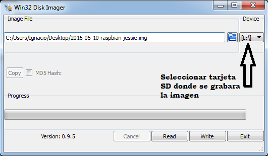
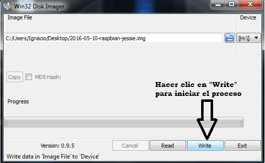
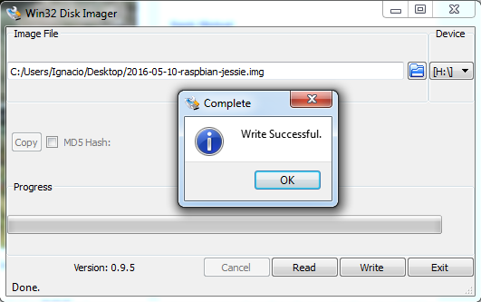

# Capitulo 2: Raspberry Pi y sus sistemas operativos


## 2.1 Linux

Un sistema operativo es un conjunto de programas básicos y utilidades que hacen que una computadora funcione.  Raspberry Pi fue diseñada para trabajar con un sistema operativo Linux. Existen varias distribuciones de Linux como Ubuntu, Fedora, Debian, Arch, etc.  Para la Raspberry Pi se creó una distribución con el nombre de Raspbian la cual está basada en Debian.  Esta fue la primera distribución que fue utilizada con la Raspberry Pi.  Hoy en día existen varias distribuciones con propósitos diferentes.  Esto habla del alto interés y entusiasmo de la comunidad hacia la Raspberry Pi.  En la página oficial de Raspberry Pi (https://www.raspberrypi.org/downloads) se encuentran los varios sistemas operativos que se pueden utilizar. La página oficial también permite las descargas de los sistemas operativos y se puede confiar que son las versiones mas recientes.    


## 2.2 Raspbian 
Raspbian es un sistema operativo libre basado en Debian y optimizado para Raspberry Pi.  Raspbian aporta más que un simple sistema operativo, cuenta con más de 35,000 paquetes, software pre-compilado empaquetado en un formato facial de instalar en la Raspberry Pi.  La primera versión con más de 35,000 paquetes optimizada para tener mejor rendimiento con la arquitectura de Raspberry Pi fue completada en junio de 2012.  A pesar de esto Raspbian aún sigue bajo desarrollo activo con un énfasis en mejorar la estabilidad y rendimiento de todos los paquetes de Debian posibles.  Es importante notar que Raspbian no está afiliado con la Fundación Raspberry Pi.  Raspbian fue creado por un pequeño pero dedicado equipo de desarrolladores que son fans de la arquitectura Raspberry Pi, las metas educativas de la fundación y el proyecto Debian. Raspbian es el sistema operativo que se utilizara en este manual.

En la página de descargas existen otros sistemas operativos para Raspberry Pi.  Algunos de estos sistemas fueron creados para cumplir ciertas tareas.  Por ejemplo OpenElec es utilizada como un centro de entretenimiento.  Weather Station es un sistema para crear una estación para vigilar el clima.  Estos son algunos ejemplos de sistemas operativos que la comunidad y otras compañías han desarrollado para Raspberry Pi.

## 2.3 Cargar un sistema operativo a una tarjeta SD en Windows

 
#### 2.3.1  Descargar imagen del sistema operativo

Para poder utilizar la Raspberry Pi se requiere de un sistema operativo.  El sistema operativo está guardado en una tarjeta MicroSD/SD dependiendo en cual modelo se utilice.  Para este manual se utilizara  una Rapberry Pi modelo B+ por lo cual el sistema operativo será guardado en una tarjeta MicroSD.  Se requiere de una imagen del sistema operativo del cual se quiera utilizar. En este caso usaremos la imagen de Raspbian que nos provee la página oficial de descargas de Raspberry Pi (https://www.raspberrypi.org/downloads/raspbian/).  Existen dos versiones, la versión completa y la versión lite que es más ligera ya que no contiene todos los paquetes, es una versión que solo contiene lo necesario para trabajar.  La versión que se utiliza en este manual es la versión completa que en este caso es Raspbian Jessie con la versión más reciente con fecha de 10 de mayo de 2016.

#### 2.3.2  Descargar Win32 Disk Imager

Para poder utilizar el sistema operativo es necesario grabar la imagen en una tarjeta MicroSD. Esto puede sonar algo trivial ya que se puede llegar a pensar que tan solo con arrastrar la imagen a la tarjeta es suficiente.  Si se hace eso el usuario se dará cuenta que no funciona.  Esto se debe a que la imagen del sistema operativo se tiene que escribir directamente bloque por bloque a la tarjeta SD. Se está creando una "imagen"  bloque por bloque, del sistema operativo así que se llevan a cabo operaciones en la memoria a un nivel más bajo.  Para esto se utilizan herramientas como Win32 Disk Imager que borra la tarjeta de todos los datos anteriores y escribe la imagen del sistema operativo, se puede descargar en https://sourceforge.net/projects/win32diskimager/ 

Una vez que se tenga la descarga lista, se instala el programa para poder utilizarlo.  **Nota: el programa se debe de inicializar en modo administrador si no puede que se muestre un mensaje de error.**

En la figura 2.1 se puede ver Win32 Disk Imager una vez instalado e inicializado.


###### Figura 2.1 Win32 Disk Imager

#### 2.3.3 Seleccionar la imagen a grabar

Con el programa trabajando hacer clic en el icono del folder azul.  La figura 2.2 muestra donde se debe hacer clic. En su computadora se debe explorar hasta encontrar la imagen del sistema operativo que se quiera grabar.

###### Figura 2.2 Seleccion de la imagen del sistem operativo

#### 2.3.3 Seleccionar la tarjeta SD

El siguiente paso es seleccionar la tarjeta en donde se desea grabar.


###### Figura 2.3 Seleccionar tarjeta SD

#### 2.3.4  Iniciar el proceso de grabar imagen en tarjeta SD

Una vez que se tenga seleccionada la imagen y la tarjeta SD, el proceso se inicia al hacer clic en el botón "Write" en el programa Win32 Disk Imager.  Este proceso puede llevar varios minutos por lo que se debe tener algo de paciencia.


###### Figura 2.4 Iniciar proceso

#### 2.3.5 Proceso completo

Una vez completado el proceso de escritura el programa muestra un mensaje que se escribió la imagen sin ningún error.  La tarjeta SD esta lista con el nuevo sistema operativo y ahora puede utilizar en la Raspberry Pi.


###### Figura 2.5 Imagen grabada sin ningun error.

## 2.4 Grabar sistema operativo a una tarjeta SD en Linux


#### 2.4.1 Descargar imagen del sistema operativo

El primer paso es descargar la imagen del sistema operativo deseado.  Se descomprime la carpeta descargada y se obtiene el archivo con extensión  “.img” que será grabado en la tarjeta SD.   

#### 2.4.2 Desmontar tarjeta SD
Con el comando:
```$ df h```
Se busca donde se encuentra la tarjeta SD.

Una vez que se encuentre la tarjeta sd se desmonta con el comando:
```$ unmount /dev/nombre_tarjeta```
Donde nombre_tarjeta es el nombre que aparece en la lista que le pertenezca a la tarjeta SD donde se grabara el sistema operativo.

#### 2.4.3 Grabar imagen a tarjeta SD
Ahora para grabar la imagen se ingresa el siguiente comando:

```$  sudo dd bs=1M if=2016-05-10-raspbian-jessie.img of=/dev/nombre_tarjeta```

En unos minutos se tendra una tarjeta SD con un sistema operativo listo para trabajar.

