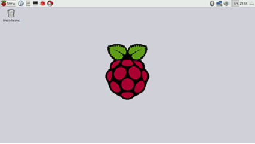
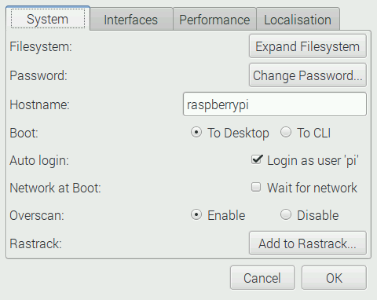
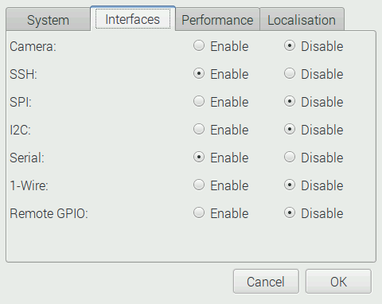
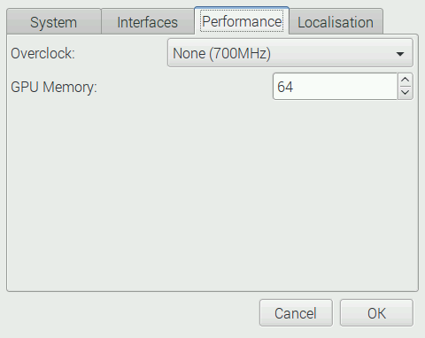
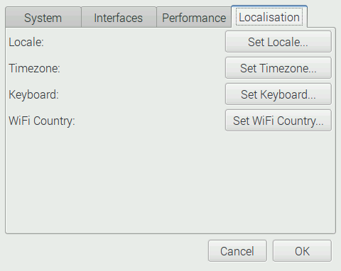

# Capítulo 2: Raspberry Pi y sus sistemas operativos


## 2.1 Linux

Un sistema operativo es un conjunto de programas básicos y utilidades que hacen que una computadora funcione.  Raspberry Pi fue diseñada para trabajar con un sistema operativo Linux. Existen varias distribuciones de Linux como Ubuntu, Fedora, Debian, Arch, etc.  Para la Raspberry Pi se creó una distribución con el nombre de Raspbian la cual está basada en Debian.  Esta fue la primera distribución que fue utilizada con la Raspberry Pi.  Hoy en día existen varias distribuciones con propósitos diferentes.  Esto habla del alto interés y entusiasmo de la comunidad hacia la Raspberry Pi.  En la página oficial de Raspberry Pi (https://www.raspberrypi.org/downloads) se encuentran los varios sistemas operativos que se pueden utilizar. La página oficial también permite las descargas de los sistemas operativos y se puede confiar que son las versiones mas recientes.    


## 2.2 Raspbian 
Raspbian es un sistema operativo libre basado en Debian y optimizado para Raspberry Pi.  Raspbian aporta más que un simple sistema operativo, cuenta con más de 35,000 paquetes, software pre-compilado empaquetado en un formato facial de instalar en la Raspberry Pi.  La primera versión con más de 35,000 paquetes optimizada para tener mejor rendimiento con la arquitectura de Raspberry Pi fue completada en junio de 2012.  A pesar de esto Raspbian aún sigue bajo desarrollo activo con un énfasis en mejorar la estabilidad y rendimiento de todos los paquetes de Debian posibles.  Es importante notar que Raspbian no está afiliado con la Fundación Raspberry Pi.  Raspbian fue creado por un pequeño pero dedicado equipo de desarrolladores que son fans de la arquitectura Raspberry Pi, las metas educativas de la fundación y el proyecto Debian. Raspbian es el sistema operativo que se utilizara en este manual.

En la página de descargas existen otros sistemas operativos para Raspberry Pi.  Algunos de estos sistemas fueron creados para cumplir ciertas tareas.  Por ejemplo OpenElec es utilizada como un centro de entretenimiento.  Weather Station es un sistema para crear una estación para vigilar el clima.  Estos son algunos ejemplos de sistemas operativos que la comunidad y otras compañías han desarrollado para Raspberry Pi.

### 2.2.1 Comandos esenciales apt para Raspbian
Los siguientes comandos son esenciales para poder utilizar el administrador de paquetes “apt” para Raspbian.

* Mostrar todos los paquetes disponibles:
  *  ``` $ apt-cache pkgnames ```
* Mostrar paquetes disponibles:
  *  ``` $ dpkg -l ``` 
* Mostrar los archivos para un paquete:
  *  ``` $ dpkg -L apt ```
* Buscar un paquete: 
  *  ``` $ apt-cache search nombre_del_paquete ```
* Instalar un paquete:
  *  ``` $ sudo apt-get install nombre_del_paquete ```
    *  **Nota: recuerde que la contraseña es *raspberry* **
*  Remover un paquete (ingresar los comandos en este orden):
  *  ``` $ apt-get remove nombre_del_paquete ```
  *   ```$ apt-get purge nombre_del_paquete ```
  *   **Nota: Si es que no se permite ingresar los comandos, agregar sudo al principio del comando para ejecutarlo como súper usuario.  **
* Instalar actualizaciones:
  *  ``` $ apt-get update ```
* Actualizar a la versión mas reciente:
  *  ```$ apt-get upgrade ```

## 2.3 Cargar un sistema operativo a una tarjeta SD en Windows

 
#### 2.3.1  Descargar imagen del sistema operativo

Para poder utilizar la Raspberry Pi se requiere de un sistema operativo.  El sistema operativo está guardado en una tarjeta MicroSD/SD dependiendo en cual modelo se utilice.  Para este manual se utilizara  una Rapberry Pi modelo B+ por lo cual el sistema operativo será guardado en una tarjeta MicroSD.  Se requiere de una imagen del sistema operativo del cual se quiera utilizar. En este caso usaremos la imagen de Raspbian que nos provee la página oficial de descargas de Raspberry Pi (https://www.raspberrypi.org/downloads/raspbian/).  Existen dos versiones, la versión completa y la versión lite que es más ligera ya que no contiene todos los paquetes, es una versión que solo contiene lo necesario para trabajar. En este manual se utiliza la versión completa que en este caso es Raspbian Jessie.

#### 2.3.2  Descargar Win32 Disk Imager

Para poder utilizar el sistema operativo es necesario grabar la imagen en una tarjeta MicroSD. Esto puede sonar algo trivial ya que se puede llegar a pensar que tan solo con arrastrar la imagen a la tarjeta es suficiente.  Si se hace eso el usuario se dará cuenta que no funciona.  Esto se debe a que la imagen del sistema operativo se tiene que escribir directamente bloque por bloque a la tarjeta SD. Se está creando una "imagen"  bloque por bloque del sistema operativo así que se llevan a cabo operaciones en la memoria a un nivel más bajo.  Para esto se utilizan herramientas como Win32 Disk Imager que borra la tarjeta de todos los datos anteriores y escribe la imagen del sistema operativo, se puede descargar en https://sourceforge.net/projects/win32diskimager/ 

Una vez que se tenga la descarga lista, se instala el programa para poder utilizarlo.  **Nota: el programa se debe de inicializar en modo administrador si no puede que se muestre un mensaje de error.**

En la figura 2.1 se puede ver Win32 Disk Imager una vez instalado e inicializado.


###### Figura 2.1 Win32 Disk Imager

#### 2.3.3 Seleccionar la imagen a grabar

Con el programa trabajando hacer clic en el icono del folder azul.  La figura 2.2 muestra donde se debe hacer clic. En su computadora se debe explorar hasta encontrar la imagen del sistema operativo que se quiera grabar.

###### Figura 2.2 Seleccion de la imagen del sistem operativo

#### 2.3.3 Seleccionar la tarjeta SD

El siguiente paso es seleccionar la tarjeta en donde se desea grabar.


###### Figura 2.3 Seleccionar tarjeta SD

#### 2.3.4  Iniciar el proceso de grabar imagen en tarjeta SD

Una vez que se tenga seleccionada la imagen y la tarjeta SD, el proceso se inicia al hacer clic en el botón "Write" en el programa Win32 Disk Imager.  Este proceso puede llevar varios minutos por lo que se debe tener algo de paciencia.


###### Figura 2.4 Iniciar proceso

#### 2.3.5 Proceso completo

Una vez completado el proceso de escritura el programa muestra un mensaje que se escribió la imagen sin ningún error.  La tarjeta SD esta lista con el nuevo sistema operativo y ahora puede utilizar en la Raspberry Pi.


###### Figura 2.5 Imagen grabada sin ningun error.

## 2.4 Grabar sistema operativo a una tarjeta SD en Linux


#### 2.4.1 Descargar imagen del sistema operativo

El primer paso es descargar la imagen del sistema operativo deseado.  Se descomprime la carpeta descargada y se obtiene el archivo con extensión  “.img” que será grabado en la tarjeta SD.   

#### 2.4.2 Desmontar tarjeta SD

* Se abre una terminal nueva y se ingresa el comando: ```$ df h```

* Se busca donde se encuentra la tarjeta SD.

* Un tip para poder localizar tu tarjeta SD es ingresar el comando: ``` $ df h``` sin la tarjeta SD en la computadora.  Aparecerá una lista con todos los dispositivos montados.  

* Inserta la tarjeta SD que se vaya a utilizar. Se vuelve a ingresar el comando: ``` $ df h``` y volverá ha aparecer la lista con los dispositivos montados pero ahora estará un nuevo dispositivo, la tarjeta SD.  Localiza el nombre y guardarlo.

* Una vez que se encuentre la tarjeta SD se desmonta con el comando: ``` $ unmount /dev/nombre_tarjeta``` Donde nombre_tarjeta es el nombre que aparece en la lista que le pertenezca a la tarjeta SD donde se grabara el sistema operativo.


#### 2.4.3 Grabar imagen a tarjeta SD
Ahora para grabar la imagen se ingresa 
el siguiente comando: ```$  sudo dd bs=1M if=2016-05-10-raspbian-jessie.img of=/dev/nombre_tarjeta```


En unos minutos se tendrá una tarjeta SD con un sistema operativo listo para trabajar.


## 2.5 Configurar Raspberry Pi

Ahora que ya se cuenta con una tarjeta SD con un sistema operativo se puede insertar a la Raspberry Pi e iniciarla por primera vez.  En la figura 2.6 se puede ver el escritorio que debe aparecer una vez que se complete el proceso de arranque.  Esto significa que el sistema operativo funciona correctamente. Si es que no se llega a este escritorio significa que algo está mal y se de rectificar.


####### Figura 2.6 Pantalla inicial


#### 2.5.1  Ventana de configuracion
Lo primero que se debe hacer es configurar la Raspberry Pi.  En Raspbian Jessie el modo de configuración ha cambiado.  En versiones anteriores el sistema operativo iniciaba con una línea de comando, pidiendo usuario y contraseña para poder continuar.  Después pasaba a la pantalla donde se encontraban los atributos configurables de la Raspberry Pi.  En esta versión de Raspbian Jessie la Raspberry Pi es completamente diferente.  Esta configuración es ahora más accesible y fácil de hacer.  El menú se puede acceder en el escritorio con lo siguientes pasos.

**MENU > PREFERENCES > RASPBERRY PI CONFIGURATION **



###### Figura 2.7 Selección del menu de configuración. 

En la pestaña de System se encuentran las siguientes configuraciones.  
* Filesystem
  * Al seleccionar esta opción se permite utilizar toda la memoria disponible en la tarjeta SD.  Es muy recomendable seleccionar esta opción.
* Password
  * Permite cambiar la contraseña de la Raspberry Pi.  La contraseña por defecto es ```raspberry```
* Hostname
  * Esta opción te permite darle un nombre para identificar la Raspberry Pi en una red o cuando se quiere conectar vía SSH.
* Boot
  * Esta opción te permite seleccionar donde inicia el sistema.  Si es que se quiere ingresar directamente al escritorio se selecciona ```To Desktop``` para utilizarla como una computadora normal.  Para ingresar a línea de comando en vez del escritorio se selecciona ```To CLI``` (Command Line Interface, interfaz de línea de comando por sus siglas en ingles).  Esto sería para utilizarla en un proyecto donde no se requiera acceder al escritorio. 
* Auto login
  * Esta opción permite acceder al sistema automáticamente si no se selecciona el usuario tendría que ingresar el nombre usuario y la contraseña.  Por defecto el nombre usuario es ```pi``` y la contraseña es ```raspberry```.
* Network at Boot
  * Esta opción te permite entrar a una red de inicio, o esperar a que la red este lista.
* Overscan
  * Se puede habilitar o deshabilitar esta opción.
* Rastrack
  * Rastrack permite agregar la Raspberry Pi a un mapa global. Esto para ver en que partes del mundo se esta utilizando esta tecnologia.


###### Figura 2.8 Pestaña Interfaces

En la pestaña de interfaces se puede deshabilitar o habilitar diferentes protocolos y accesorios como la camara que no funcionara si no es habilitada.


###### Figura 2.9 Pestaña Performance

En esta pestaña se puede ocnfigurar la velocidad a que trabaja la Raspberry Pi y cuanta memoria se le permite utilizar a la GPU para mayor rendimiento.

* Overclock
  * None (700MHz) Velocidad normal.
  * Modest (800MHz)
  * Medium (900MHz)
  * High (950MHz)
  * Turbo (1000MHz)
  * **Nota: Recuerde que incrementar la velocidad puede causar que se sobrecaliente la Raspberry Pi y puede causar que termine inservible.**
* GPU Memory


###### Figura 2.10 Localización 
En esta pestaña se pueden configurar los siguientes atributos:
* Locale
  * En que parte del mundo se encuentra, tambien para poder configurar el idioma.
* Timezone
  * La zona de tiempo en la que se ubica.
* Keyboard
  * Para que el teclado utilizado funcione correctamente.
* WiFi Country
  * Seleccionar el país donde se reside para poder acceder a WiFi.


## 2.6 Resumen
En este capítulo se explica el sistema operativo de la Raspberry Pi y como es que utiliza una tarjeta SD/Micro SD como disco duro para cargarlo y guardar información.  Se muestra como se graba una imagen de un sistema operativo para ser utilizado por la Raspberry Pi.  Raspbian es el sistema operativo derivado de Debian y diseñado para trabajar con la arquitectura Raspberry Pi.   Se muestra dónde es que el usuario puede configurar el sistema operativo a su gusto o necesidad. 

