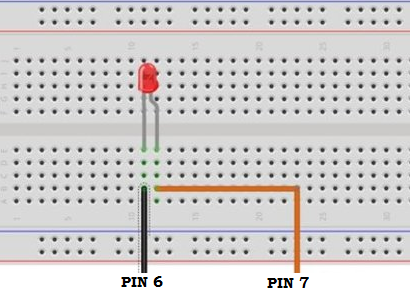
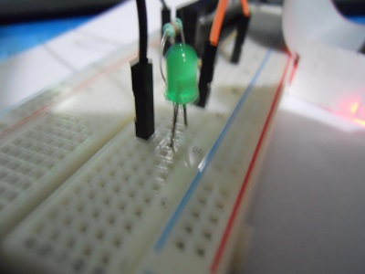
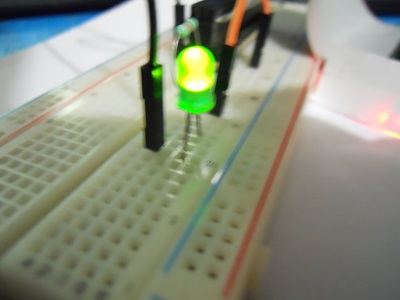
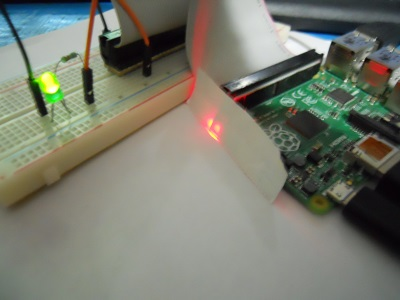

# Capitulo 4: "Hola, Mundo!" con Raspberry Pi

## Proyecto
Ahora que contamos con una Raspberry Pi configurada y lista para trabajar con los pines GPIO es tiempo de realizar un proyecto.  Este proyecto es sencillo, el “Hola, Mundo!” de la Raspberry Pi.  El gran reto será hacer que un LED parpadee puede sonar algo trivial pero no lo es.

## Material
* Raspberry Pi
* LED
* Resistencia de 330 ohm
* Cables para conectar el circuito 
* Placa de prototipo sin soldar
* Cable hembra-macho para conectar pines GPIO a la placa


Los pines GPIO están conectados directamente a los pines del CPU en la Raspberry Pi así que no existe algún tipo de protección y se debe tener mucho cuidado.  Se utilizara una placa de prototipo sin soldar para crear el circuito.  En la figura 4.1 se puede ver el circuito que se creara.  El pin 7 de la Raspberry Pi está conectado al final positivo del circuito mientras que el pin 6 el cual es tierra (GND) está conectado al lado negativo del circuito.



###### Figura 4.1 Circuito a implementar.


Con el conocimiento de cómo se armara el circuito se procede a implementarlo. La figura 4.2 muestra el circuito armado en la placa de prototipo.  Con el circuito implementado ahora se puede proceder programar los pines GPIO.


###### Figura 4.2 Circuito implementado.


## Código 
En esta parte del proyecto se desarrollara el código que nos permitirá controlar los pines GPIO.  Este programa lograra que el LED parpadee de forma continua y así crear el “Hola, Mundo!” de Raspberry Pi.  A lo largo de esta sección se es estará explicando detalladamente las partes del código de arriba hacia abajo. Esto con el fin de que el usuario pueda entender el código y que es lo que se está haciendo.

#### Importar el módulo RPi.GPIO
El paquete RPi,GPIO que se instaló en el capítulo 3 nos permite controlar los pines GPIO a través de clases.  Para poder utilizar este módulo debemos importarlo en la cabecera del código que se está desarrollando. Esto se hace escribiendo al principio del archivo:

```python
import RPi.GPIO as GPIO
```

Esto nos permite referirnos al módulo con solo escribir GPIO y no todo el nombre de RPi. GPIO.

#### Especificar el modo de operación
Lo siguiente es especificar en qué modo de operación se usara el módulo GPIO.  Se tiene que tener en cuenta que la Raspberry Pi y el CPU tienen diferentes números de pines.  Es por eso que es muy importante designar que modo se usara. Existen dos modos de operación.  El modo BOARD, que utiliza el sistema de numeración de pines de la Raspberry Pi. El modo BCM que utiliza el sistema de numeración del CPU.  En nuestro código es donde especificamos que modo se va a usar simplemente con escribir:

```python
GPIO.setmode(GPIO.BOARD) # para usar numeración Raspberry Pi
  # o
GPIO.setmode(GPIO.BCM)   # para usar numeración CPU
```


#### Crear un canal
Ahora se tiene que crear un canal ya sea como entrada o salida.  Esto se puede hacer escribiendo dentro de nuestro código:

```python
GPIO.setup(canal, GPIO.IN)   # canal de entrada
  # o
GPIO.setup(canal, GPIO.OUT)  # canal de salida
```

Donde canal es una variable que contiene el número del pin que se usara.  En este caso, el LED se conectó al pin 7 de la Raspberry Pi. Esto significa que se debe configurar ese pin como un canal de salida.  Si es que se utiliza el modo BCM, el pin 7 esta como el GPIO4 en el CPU.  Esto es lo que se debe agregar al código:

```python
GPIO.setup(7, GPIO.OUT)  # si modo BOARD es usado
  # o 
GPIO.setup(4, GPIO.OUT)  # si modo BCM es usado
```

**Nota: se recomienda utilizar el sistema de numeración de la Raspberry Pi (BOARD) ya que es más fácil de seguir y utilizar.  Aunque no importa mucho cual sistema se utiliza si es importante ser consistente y utilizarlo en todo el proyecto.**

#### Conducir un canal
Lo que sigue es conducir el canal que se utilizara a ALTO o BAJO.  Esto se puede hacer de una de las tres formas, cualquiera de las tres es válida:

```python
GPIO.output(7,True)
  # o
GPIO.output(7, GPIO.HIGH)
  # o
GPIO.output(7, 1)
```

Para conducir el mismo pin 7 a BAJO se puede utilizar cualquiera de los tres comandos:

```python
GPIO.output(7, False)
   # o
GPIO.output(7, GPIO.LOW)
   # o
GPIO.output(7, 0)
```

#### Leer un canal
Para leer el valor de cualquier pin GPIO se utiliza:

```python
GPIO.input(canal)
```

Donde canal es el canal que se quiere leer.  

#### Limpiar
Una vez que se terminen todas las operaciones del módulo GPIO se debe de limpiar y liberar los recursos utilizados por el programa.  No es necesario hacer esto pero si una buena costumbre de programación. 

```python
GPIO.cleanup()
```





