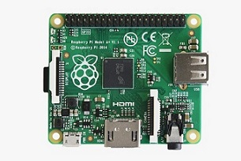

# Introducción a la Raspberry Pi

## Primera generación

| Raspberry Pi | Modelo A    | Modelo A+ |
| ---- | :----: | :----: |
|  |  | |
| Fecha de lanzamiento | Febrero 2013 | Noviembre 2014 |
| Precio | US$25 | US$20 |
| SoC (Sistema-en-Chip) | Broadcom BCM2835 | Broadcom BCM2835 |
| CPU | 700 MHz ARM1176JZF-S de un nucleo |  igual que el modelo A |
| GPU | Broadcom VideoCore IV @ 250 MHz (BCM2837: parte 3D del GPU @ 300 MHz, parte de video del GPU @ 400 MHz);  OpenGL ES 2.0 (BCM2835, BCM2836: 24 GFLOPS / BCM2837: 28.8 GFLOPS) MPEG-2 y VC-1 (con licensia); 1080p30 H.264/MPEG-4 AVC decodificador y encodificador de alto perfil (BCM2837: 1080p60) | igual que el modelo A |
| Memoria (SDRAM) | 256 MB @ 400MHz(compartida con GPU)| 512 MB @ 400MHz (compartida con GPU) a partir de mayo de 2016, los modelos iniciales eran frabicadas con 256 MB (compartida con GPU) |
| Voltaje y Poder | 600mA @ 5V | 600mA @ 5V |
| Fuente de poder | 5V via MicroUSB | 5V via MicroUSB |
| GPIO | 26 | 40 |
| Almacenamiento| Tarjeta SD | Tarjeta MicroSD|
| Video | HDMI, video compuesto via toma RCA| HDMI, video compuesto via toma TRRS 3.5 mm|
| Audio | Audio digital via HDMI, Audio analogo via toma de telefono 3.5 mm | igual que el Modelo A |
| USB 2.0 | 1 | 1 |
| Tamaño | 85x56mm | 65x56mm |

| Raspberry Pi | Modelo B    | Modelo B+ |
| ---- | :----: | :----: |
|  | | |
| Fecha de lanzamiento | Abril-Junio 2012 | Julio 2014 |
| Precio | US$35 | US$25 |
| SoC (Sistema-en-Chip) | Broadcom BCM2835 | Broadcom BCM2835 |
| CPU | 700 MHz ARM1176JZF-S de un nucleo |  igual que el modelo B |
| GPU | Broadcom VideoCore IV @ 250 MHz (BCM2837: parte 3D del GPU @ 300 MHz, parte de video del GPU @ 400 MHz);  OpenGL ES 2.0 (BCM2835, BCM2836: 24 GFLOPS / BCM2837: 28.8 GFLOPS) MPEG-2 y VC-1 (con licensia); 1080p30 H.264/MPEG-4 AVC decodificador y encodificador de alto perfil (BCM2837: 1080p60) | igual que el modelo B |
| Memoria (SDRAM) | 512 MB @ 400MHz(compartida con GPU)| 512 MB @ 400MHz (compartida con GPU)|
| Voltaje y Poder | 600mA @ 5V | 600mA @ 5V |
| Fuente de poder | 5V via MicroUSB | 5V via MicroUSB |
| GPIO | 26 | 40 |
| Almacenamiento| Tarjeta SD | Tarjeta MicroSD|
| Video | HDMI, video compuesto via toma RCA| HDMI, video compuesto via toma TRRS 3.5 mm|
| Audio | Audio digital via HDMI, Audio analogo via toma de telefono 3.5 mm | igual que el modelo B |
| USB 2.0 | 2 | 4 |
| Tamaño | 85x56mm | 85x56mm |

## Segunda generación

| Version | Raspberry Pi 2  | Raspberry Pi 3 |
| ---- | :----: | :----: |
|  | | |
| Fecha de lanzamiento |Febrero 2015 | Febrero 2016 |
| Precio | US$35 | US$35 |
| SoC (Sistema-en-Chip) | Broadcom BCM2836 | Broadcom BCM2837 |
| CPU | 900 MHz 32-bits ARM Cortex-A7 de cuatro nucleos | 1.2 GHz 64-bits ARM Cortex-A53 de cuatro nucleos |
| GPU | Broadcom VideoCore IV @ 250 MHz (BCM2837: parte 3D del GPU @ 300 MHz, parte de video del GPU @ 400 MHz);  OpenGL ES 2.0 (BCM2835, BCM2836: 24 GFLOPS / BCM2837: 28.8 GFLOPS) MPEG-2 y VC-1 (con licensia); 1080p30 H.264/MPEG-4 AVC decodificador y encodificador de alto perfil (BCM2837: 1080p60) | igual que la Raspberry Pi 2 |
| Memoria (SDRAM) | 1 GB(compartida con GPU)| 1 GB(compartida con GPU)|
| Voltaje y Poder | 650mA @ 5V | 800mA @ 5V |
| Fuente de poder | 5V via MicroUSB | 5V via MicroUSB |
| GPIO | 40 | 40 |
| Almacenamiento| Tarjeta MicroSD | Tarjeta MicroSD|
| Video |HDMI, video compuesto via toma TRRS 3.5 mm| HDMI, video compuesto via toma TRRS 3.5 mm|
| Audio | Audio digital via HDMI, Audio analogo via toma de telefono 3.5 mm | igual que la Raspberry Pi 2 |
| USB 2.0 | 4 | 4 |
| Tamaño | 85x56mm | 85x56mm |
