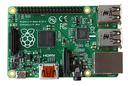

# Capitulo 1: Introducción

## 1.1 Proyecto Raspberry Pi {#ProyectoRaspberryPi}
En el año 2006 el Dr. Eben Upton hizo una observación acerca de los estudiantes que ingresaban a la carrera de ciencias de la computación, con cada generación nueva el conocimiento sobre temas de computación disminuía.  El llego a la conclusión que esto podría ser por el alto costo de las computadoras.  Así que junto con sus colegas en el Laboratorio de Computo de la Universidad de Cambridge en Cambridge, Inglaterra crearon la Fundación Raspberry Pi (The Raspberry Pi Foundation, www.raspberrypi.org).  El propósito principal de la fundación fue crear una computadora barata a la que personas de bajos recursos pudieran tener acceso.  Ellos creían que el alto costo de las computadoras era un impedimento para que los padres les pudieran comprar una y así aprender.  Eliminando el alto costo lograría que los estudiantes lograran tener una computadora con cual experimentar, crear y aprender a programar sin la preocupación de arruinar una computadora de alto precio.  

El éxito de la Fundación Raspberry Pi ha sido abrumador.  Las primeras versiones de la Raspberry Pi fueron vendidas en el año 2012.  En su primer año vendieron se vendieron más de las 10,000 unidades estimadas y desde entonces ha sido todo un éxito.  La Fundación anuncio en Febrero de 2016  que habían vendido más de 8 millones de unidades convirtiéndola en la computadora más vendida en Inglaterra.

Una decisión clave en el diseño que permitió mantener el costo bajo fue utilizar la tecnología de sistema en un chip (System on a Chip, SoC).  Un sistema en un chip integra el microprocesador, la memoria, y el procesador de gráficos en un tipo de “sándwich”  de silicón que en turno minimiza el espacio de la placa de circuito impreso.  La Fundación se asoció con Broadcom para utilizar sus diseños de microprocesador y el procesador de gráficos en el SoC.

## 1.2 Broadcom

#### 1.2.1 Raspberry Pi 1
El sistema en un chip de los primeros modelos de la Raspberry Pi utilizó el Broadcom BCM2835 como su microprocesador y su unidad de procesamiento de gráficos (graphics procressing unit, GPU por sus siglas en ingles).   El BCM2835 está compuesto de un microprocesador ARM1176JZF-S que trabaja a 700 MHz y un Broadcom VideoCore® IV GPU.   El BCM2835 está diseñado para aplicaciones móviles y es por eso que requiere operar con poder mínimo para poder extender la vida de la batería.  EL BCM2835 opera a 700 MHz, una velocidad baja de reloj para un microprocesador que permite reducir el consumo de energía.  Una velocidad baja de reloj también le permite a la raspberry pi operar a voltaje bajo disminuyendo el calor generado y extendiendo la vida del chip.  Se puede incrementar la velocidad, con un proceso llamado “overclocking”, esto le da un rendimiento superior pero con el riesgo de que el microprocesador se vuelva operacionalmente inestable y reduce la vida del chip.  

Para el procesador gráfico el BCM2835 utiliza el Broadcom VideoCore IV GPU el cual se encarga del procesamiento de audio y video.  Este GPU apoya directamente el estándar OpenGL ES 2.0 que es capaz de trabajar en hardware embebido, el cual en este caso es el Broadcom 2835.  Puede mostrar gráficos en tres dimensiones y tiene todo lo necesario para juegos modernos y video de alta definición (HD, high definición por sus siglas en ingles).  Implementa en hardware un H.264 códec requerido para HD que produce una definición de 1080p a 30 cuadros/segundo.

#### 1.2.2 Raspberry Pi 2 y Raspberry Pi 3

Para la raspberry pi 2 el sistema en un chip utiliza el Broadcom 2836.  La arquitectura es casi idéntica al Broadcom 2835 lo única diferencia significante es el cambio de microprocesador ARM1176JZF-S por un ARM Cortex-A7 de cuatro núcleos.  El Cortex-A7 trabaja a 900 MHz, 200 MHz más que el de la raspberry pi 1.  El GPU utilizado en el BCM2836 es el mismo que el del BCM2835.  Raspberry Pi 3 utiliza el Broadcom 2837 el cual tiene como microprocesador ARM Cortex-A53 de cuatro núcleos que trabaja a 1.2 GHz.  Utiliza el mismo GPU que la Raspberry Pi 1 y 2.

## 1.3 Memoria

Raspberry Pi utiliza dos tipos de memoria, memoria dinámica de acceso aleatorio (dynamic random access memory o DRAM) y MicroSD (Secure Digital).  En los primeros modelos A y B de la raspberry pi 1 se utilizaban tarjetas SD en los modelos posteriores, A+, B+ y raspberry pi 2 y 3 se cambió a MicroSD.  La memoria DRAM en el modelo A era de 256 MB, los modelos A+, B, y B+ contaban con una memoria de 512 MB. La raspberry pi 2 y 3 tienen 1 GB de memoria.  El sistema operativo de la raspberry pi es guardado en la MicroSD o tarjeta SD dependiendo del modelo.  Ahí también se guarda todos los programas e información relacionada con la raspberry pi.  Esta memoria es utilizada como una computadora de escritorio utiliza un disco duro, para guardar información y programas que se utilicen.  

## 1.4 Conexiones 

* MicroUSB 5V Poder
* Salida HDMI
* 4 Puertos USB 2.0
* Puerto Ethernet (excepto los modelos A y A+)
* GPIO 40 Pines
* SD/MicroSD slot (dependiendo el modelo
* Conector para Camara CSI 
* Conector para Monitor DSI
* Conector de Video/Audio Stereo

Los proyectos en este manual serán desarrollados con una Raspberry Pi 1 Modelo B+.  En la figura 1.1 se muestra dónde quedan los puertos y conexiones importantes del Modelo B+.

######Figura 1.1 Conexiones y puertos Raspberry Pi 1 Modelo B+  

## 1.5 Protocolos seriales que utiliza Raspberry Pi
* Serial Peripheral Interface (SPI, Interfaz Periférica Serial)
  * Es un enlace sincrónico de serie de datos.   Ocupa una señal de reloj ya que es sincrónico.  Es un protocolo dúplex completo lo que significa que puede mandar y recibir información simultáneamente del maestro (anfitrión) y del esclavo
* Inter-Integrated Circuit (I2C, circuito inter-integrado)
  * Este protocolo también es un enlace sincrónico de serie de datos.  El protocolo I2C soporta más de un maestro y múltiples esclavos.
* Universal Asynchronous Receiver Transmitter (UART, Receptor-Transmisor Asíncrono Universal)
  * El protocolo UART no requiere de una señal de reloj.  La Raspberry Pi transmite información en el pin con el nombre TXD0 y recibe en el pin con el nombre RXD0.  Como este protocolo es utilizada para la comunicación de datos y no para controlar, no cuenta con el concepto de maestro-esclavo como los protocolos SPI e I2C.  

## 1.6 Comparacion de las diferentes versiones de Raspberry Pi 
### 1.6.1 Primera generación

######Tabla 1.1 Raspberry Pi 1 Modelo A y Modelo A+

| Raspberry Pi | Modelo A    | Modelo A+ |
| ---- | :----: | :----: |
|  |  | |
| Fecha de lanzamiento | Febrero 2013 | Noviembre 2014 |
| Precio | US$25 | US$20 |
| SoC (Sistema-en-Chip) | Broadcom BCM2835 | Broadcom BCM2835 |
| CPU | 700 MHz ARM1176JZF-S de un nucleo |  igual que el modelo A |
| GPU | Broadcom VideoCore IV @ 250 MHz, OpenGL ES 2.0, MPEG-2 y VC-1 (con licensia); 1080p30 H.264/MPEG-4 AVC decodificador y encodificador de alto perfil  | igual que el modelo A |
| Memoria (SDRAM) | 256 MB @ 400MHz(compartida con GPU)| 512 MB @ 400MHz (compartida con GPU) a partir de mayo de 2016, los modelos iniciales eran frabicadas con 256 MB (compartida con GPU) |
| Voltaje y Poder | 600mA @ 5V | 600mA @ 5V |
| Fuente de poder | 5V via MicroUSB | 5V via MicroUSB |
| GPIO | 26 | 40 |
| Almacenamiento| Tarjeta SD | Tarjeta MicroSD|
| Video | HDMI, video compuesto via toma RCA| HDMI, video compuesto via toma TRRS 3.5 mm|
| Audio | Audio digital via HDMI, Audio analogo via toma de telefono 3.5 mm | igual que el Modelo A |
| USB 2.0 | 1 | 1 |
| Tamaño | 85x56mm | 65x56mm |

 
  
######Tabla 1.2 Raspberry Pi 1 Modelo B y Modelo B+

| Raspberry Pi | Modelo B    | Modelo B+ |
| ---- | :----: | :----: |
|  | | |
| Fecha de lanzamiento | Abril-Junio 2012 | Julio 2014 |
| Precio | US$35 | US$25 |
| SoC (Sistema-en-Chip) | Broadcom BCM2835 | Broadcom BCM2835 |
| CPU | 700 MHz ARM1176JZF-S de un nucleo |  igual que el modelo B |
| GPU | Broadcom VideoCore IV @ 250 MHz, OpenGL ES 2.0, 1080p30 H.264/MPEG-4 AVC decodificador y encodificador de alto perfil | igual que el modelo B |
| Memoria (SDRAM) | 512 MB @ 400MHz(compartida con GPU)| 512 MB @ 400MHz (compartida con GPU)|
| Voltaje y Poder | 600mA @ 5V | 600mA @ 5V |
| Fuente de poder | 5V via MicroUSB | 5V via MicroUSB |
| GPIO | 26 | 40 |
| Almacenamiento| Tarjeta SD | Tarjeta MicroSD|
| Video | HDMI, video compuesto via toma RCA| HDMI, video compuesto via toma TRRS 3.5 mm|
| Audio | Audio digital via HDMI, Audio analogo via toma de telefono 3.5 mm | igual que el modelo B |
| USB 2.0 | 2 | 4 |
| Tamaño | 85x56mm | 85x56mm |

### 1.6.2 Segunda generación
######Tabla 1.3 Raspberry Pi 2 y Raspberry Pi 3
| Version | Raspberry Pi 2  | Raspberry Pi 3 |
| ---- | :----: | :----: |
|  | | |
| Fecha de lanzamiento |Febrero 2015 | Febrero 2016 |
| Precio | US$35 | US$35 |
| SoC (Sistema-en-Chip) | Broadcom BCM2836 | Broadcom BCM2837 |
| CPU | 900 MHz 32-bits ARM Cortex-A7 de cuatro nucleos | 1.2 GHz 64-bits ARM Cortex-A53 de cuatro nucleos |
| GPU | Broadcom VideoCore IV @ 250 MHz (BCM2837: parte 3D del GPU @ 300 MHz, parte de video del GPU @ 400 MHz);  OpenGL ES 2.0 24 GFLOPS MPEG-2 y VC-1 (con licensia); 1080p30 H.264/MPEG-4 AVC decodificador y encodificador de alto perfil | Broadcom VideoCore IV parte 3D del GPU @ 300 MHz, parte de video del GPU @ 400 MHz; OpenGL ES 2.0 28.8 GFLOPS,  1080p 60cuadros/segundo H.264/MPEG-4 AVC decodificador y encodificador de alto perfil |
| Memoria (SDRAM) | 1 GB(compartida con GPU)| 1 GB(compartida con GPU)|
| Voltaje y Poder | 650mA @ 5V | 800mA @ 5V |
| Fuente de poder | 5V via MicroUSB | 5V via MicroUSB |
| GPIO | 40 | 40 |
| Almacenamiento| Tarjeta MicroSD | Tarjeta MicroSD|
| Video |HDMI, video compuesto via toma TRRS 3.5 mm| HDMI, video compuesto via toma TRRS 3.5 mm|
| Audio | Audio digital via HDMI, Audio analogo via toma de telefono 3.5 mm | igual que la Raspberry Pi 2 |
| USB 2.0 | 4 | 4 |
| Tamaño | 85x56mm | 85x56mm |
